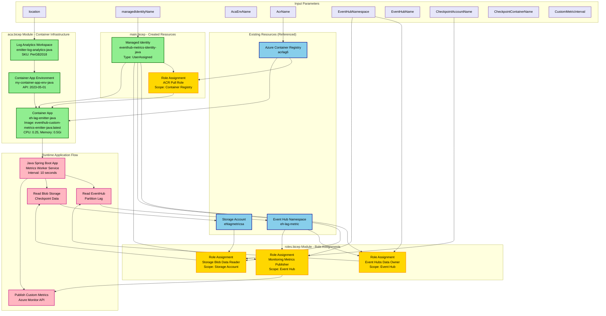
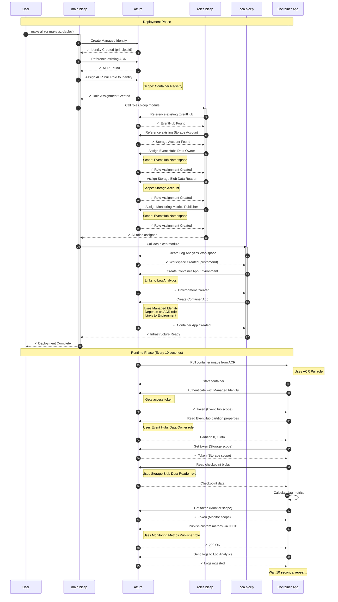

# EventHub Custom Metrics Emitter - Infrastructure Diagram

## Mermaid Flow Diagram

Copy and paste this into any Mermaid-compatible viewer (GitHub, Mermaid Live Editor, etc.):

## Legend

- 🟢 **Green** - Resources created by deployment
- 🔵 **Blue** - Existing resources (must exist before deployment)
- 🟡 **Yellow** - Role assignments (RBAC permissions)
- 🌸 **Pink** - Runtime application flow
- 🟣 **Purple** - Input parameters

## Deployment Flow

1. **Create Managed Identity** → Used for all authentication
2. **Assign ACR Pull Role** → Allows pulling container images
3. **Create roles.bicep module** → Assigns EventHub, Storage, and Monitoring permissions
4. **Create aca.bicep module** → Sets up Log Analytics, Container App Environment, and Container App
5. **Runtime** → Application reads EventHub lag, reads checkpoints from Storage, publishes to Azure Monitor

## Key Dependencies

- Container App **depends on** ACR Pull role assignment (can't pull image without it)
- Container App **uses** Managed Identity for authentication
- Application **requires** 3 role assignments to function:
  - Event Hubs Data Owner (read partition info)
  - Storage Blob Data Reader (read checkpoints)
  - Monitoring Metrics Publisher (publish custom metrics)

## Resource Naming

| Resource Type | Name | Defined In |
|--------------|------|------------|
| Managed Identity | `eventhub-metrics-identity-java` | param.json |
| Container App | `eh-lag-emitter-java` | aca.bicep (hardcoded) |
| Container App Environment | `my-container-app-env-java` | param.json |
| Log Analytics Workspace | `emitter-log-analytics-java` | aca.bicep (hardcoded) |
| ACR | `acrlag6` | param.json |
| Event Hub Namespace | `eh-lag-metric` | param.json (existing) |
| Storage Account | `ehlagmetricsa` | param.json (existing) |

---

## Deployment Flow Sequence Diagram

This diagram shows the **order of deployment steps** and dependencies:

## Deployment Steps Summary

### Phase 1: Identity and Permissions (main.bicep)
1. **Create Managed Identity** - The security principal for all operations
2. **Assign ACR Pull Role** - Enables pulling container images

### Phase 2: Application Permissions (roles.bicep)
3. **Assign Event Hubs Data Owner** - Read partition lag information
4. **Assign Storage Blob Data Reader** - Read checkpoint data
5. **Assign Monitoring Metrics Publisher** - Publish custom metrics

### Phase 3: Container Infrastructure (aca.bicep)
6. **Create Log Analytics Workspace** - Centralized logging
7. **Create Container App Environment** - Hosting environment
8. **Create Container App** - Deploy the application container

### Phase 4: Runtime Execution (Every 10 seconds)
9. **Authenticate** - Get access tokens via Managed Identity
10. **Read EventHub** - Get partition properties
11. **Read Storage** - Get checkpoint data
12. **Calculate** - Compute lag metrics
13. **Publish** - Send metrics to Azure Monitor
14. **Log** - Send application logs to Log Analytics

## Critical Dependencies

The sequence diagram shows these **must-happen-before** relationships:

- ✅ **Managed Identity must exist** before any role assignments
- ✅ **ACR Pull role must be assigned** before Container App creation
- ✅ **Log Analytics must exist** before Container App Environment
- ✅ **Container App Environment must exist** before Container App
- ✅ **All role assignments must complete** before application can function properly

---

## How to View These Diagrams

1. **In VS Code**: Press `Ctrl+Shift+V` (or `Cmd+Shift+V`) to open Markdown preview
2. **Online**: Copy the code and paste into https://mermaid.live/
3. **GitHub**: Push to GitHub and view the README - Mermaid renders automatically!

